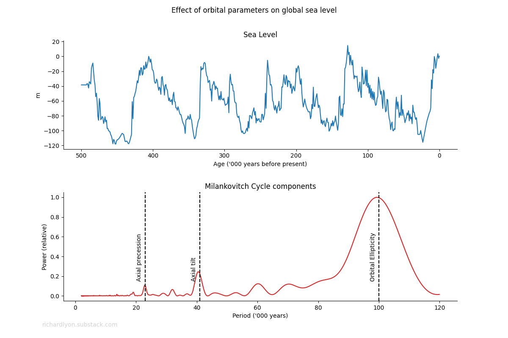

# Milankovitch

**A python script for examining Milankovitch cycle components in the Earth's global sea level record.**



Global sea level has varied by over 120 meters in the last 500,000 thousands years. Examination of the data reveals
at least one cyclical component at a period of around 100,000 years.

This script applies the Fourier Transform to sea level data to compute the power spectra. This reveals significant
frequencies corresponding to the Earth's orbital ellipticity, axial tilt, and axial precession.

**To run:**

1. Download the repository
2. Navigate to `milankovitch/dist`
3. In a terminal, type:

```
> pip install milankovitch-1.0-py3-none-any.whl
> sealevel
```

## Datasources

CO2, temperature, and dust data is obtained from the National Oceanic and Atmospheric Administration (NOAA) [National
Centers for Environmental Information](https://www.ncei.noaa.gov/access/paleo-search/).

CO2 data is
the [EPICA Dome C - 800KYr CO2 Data](https://www.ncei.noaa.gov/pub/data/paleo/icecore/antarctica/epica_domec/vostok-edc3-co2-2008-noaa.txt)
dataset.

Temperature is
the [EPICA Dome C Ice Core 800KYr Deuterium Data and Temperature Estimates](https://www.ncei.noaa.gov/pub/data/paleo/icecore/antarctica/epica_domec/edc3deuttemp2007.txt)
dataset.

Dust is
the [EPICA Dome C Ice Core 800KYr Dust Data](https://www.ncei.noaa.gov/pub/data/paleo/icecore/antarctica/epica_domec/edc-dust2008.txt)
dataset.

Sea level is a dataset obtained from
the  [Research School of Earth Sciences](https://github.com/ANU-RSES-Education/EMSC-4033/tree/master/Notebooks/StepByStep/Ex17).

# Changelog

## Unreleased

- Add European Project for Ice Coring in Antarctica as a datasource

## [1.0] --- 5 April 2023

- Initial release