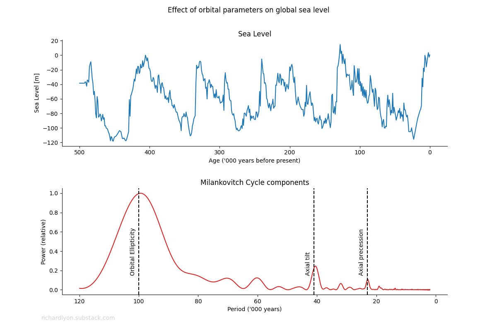

# Milankovitch

**A python script for examining Milankovitch cycle components in the Earth's global sea level record.**



Global sea level has varied by over 120 meters in the last 500,000 thousands years. Examination of the data reveals
at least one cyclical component at a period of around 100,000 years.

This script applies the Fourier Transform to sea level data to compute the power spectra. This reveals significant
frequencies corresponding to the Earth's orbital ellipticity, axial tilt, and axial precession.

**To run:**

1. Download the repository
2. Navigate to `milankovitch/dist`
3. In a terminal, type:

```
> pip install milankovitch-1.0-py3-none-any.whl
> sealevel
```

## Datasources

| Name                                | Source                                                                                                                     | Description    |
|:------------------------------------|:---------------------------------------------------------------------------------------------------------------------------|:---------------|
| [RSL_data.xlsx](data/RSL_data.xlsx) | [Research School of Earth Sciences](https://github.com/ANU-RSES-Education/EMSC-4033/tree/master/Notebooks/StepByStep/Ex17) | Sea level data |